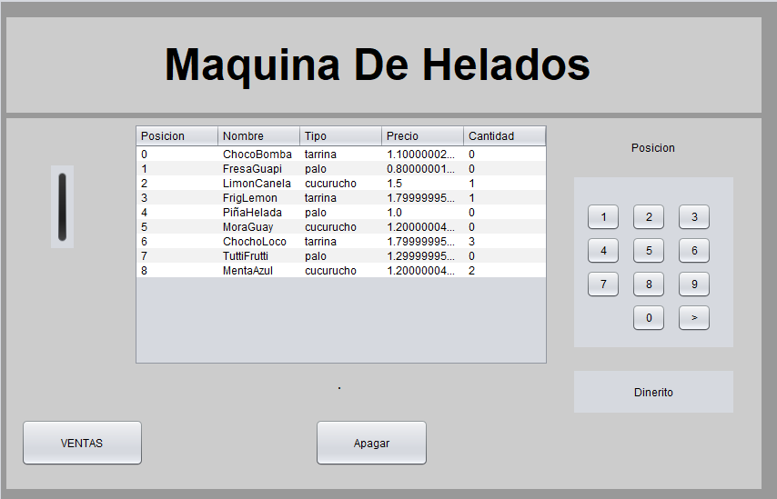

# Máquina de Helados 🍦


¡Bienvenido a mi proyecto de **Máquina de Helados** en Java!  
Este programa simula el funcionamiento de una máquina de helados con diferentes sabores y combinaciones.

---

## 🚀 Tecnologías


- **Lenguaje:** Java  
- **IDE:** Apache NetBeans  
- **Build:** Ant  

---

## 📸 Capturas del Programa

### Pantalla principal



---

## ⚙️ Cómo ejecutar

1. Clonar el repositorio:  
```bash
git clone git@github.com:TU-USUARIO/NOMBRE-DEL-REPO.git

2. Abrir el proyecto en Apache NetBeans.

3. Ejecutar la clase principal: Maquina.java.


